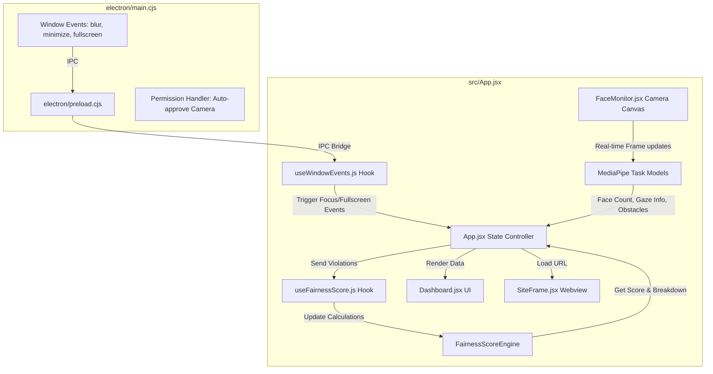

# Secure Assessment PoC — Complete Build & Architecture Guide

**Target**: Working Electron app (React + MediaPipe AI Monitoring + Gaze Tracking + Object/Obstacle Detection + Fairness Score Engine).  
**All files are already written.** Follow the milestones below — each one builds on the last.

---

## 🔄 Platform Flow (Teacher → Student)

This is the canonical end-to-end flow the platform is built around. The student **registers their details first**, then enters the teacher's code, which is the access gate that starts the test.

> This is **registration / identity capture**, not a password login — there are no accounts. The **code entry** is the actual access-control step.

```
TEACHER (website)
  1. Paste the assessment link (Google Form, YouTube, any URL)
  2. Choose a strictness preset (Level 1 / 2 / 3 / Custom) + optional expiry
  3. Generate a 6-char alphanumeric code (stored in the backend DB)
  4. Share the code with students

STUDENT (Electron app)
  1. Registration screen — enter & validate: Name, Enrollment Number, Batch, Email
  2. Enter the 6-char code → backend resolves it (rejects unknown / expired / revoked)
  3. Pre-flight system check — camera works, face detected, network up
  4. Consent notice → camera starts
  5. Test window opens: the resolved URL loads in the secure webview;
     monitoring + fairness engine run under the code's strictness preset
  6. On session end: fairness score + violations + identity are saved
```

Steps of this flow are tracked across the project's open issues (registration/code flow, backend/DB, code format, strictness presets, expiry, pre-flight check, consent, and results persistence).

---

## 🚀 Quick Start / Local Setup

Follow these steps to run the application locally on your machine:

1. **Clone the repository**:
   ```bash
   git clone https://github.com/Ashutosh-1304/Smart-Browser-For-Tests.git
   cd Smart-Browser-For-Tests
   ```

2. **Install all dependencies**:
   ```bash
   npm install
   ```

3. **Run the development server**:
   ```bash
   npm run dev
   ```
   *Note: This command concurrently runs the Vite frontend development server and the Electron wrapper.*

---

## Project Structure (Current Status)

```
minor 1/
├── electron/
│   ├── main.cjs          ← Electron main process (window lifecycle + OS IPC events)
│   └── preload.cjs       ← Secure preload bridge (exposes window.electronAPI to React)
├── src/
│   ├── components/
│   │   ├── Dashboard.jsx    ← Phase 4: Circular score gauge + violation breakdown bars + history logs
│   │   ├── FaceMonitor.jsx  ← Phase 2: Live webcam + MediaPipe models (Face, Landmarker, Object Detector)
│   │   └── SiteFrame.jsx    ← Phase 1: Bypasses iframe restrictions using Electron's <webview>
│   ├── engine/
│   │   └── FairnessScoreEngine.js ← Framework-agnostic weighted & auto-normalized scoring engine
│   ├── hooks/
│   │   ├── useFairnessScore.js   ← React hook wrapper for FairnessScoreEngine
│   │   └── useWindowEvents.js    ← Phase 3: Subscribes to Electron IPC events (focus, minimize, fullscreen)
│   ├── App.jsx           ← Main React component (state management, debouncing & coordinates components)
│   ├── main.jsx          ← React entry point (no StrictMode to prevent camera re-initialization flicker)
│   └── index.css         ← UI styling (glassmorphism dashboard layout, animations)
├── index.html            ← Base HTML template
├── vite.config.js        ← Vite build configuration
├── package.json          ← Node scripts and dependencies
└── .gitignore            ← Git exclusion rules
```

---

## Milestone 0: Verify Dependencies Installed

**What we're checking**: npm installed everything successfully.

### Commands

```bash
npm list --depth=0
```

**Expected output**: You should see:
- `electron`
- `react`
- `vite`
- `@mediapipe/tasks-vision` (version `0.10.20` or compatible)
- `concurrently`
- `wait-on`
No peer dependency or installation errors.

---

## Milestone 1: Launch the App (Phase 1)

**What this proves**:
- Electron launches.
- Vite serves the React UI on `127.0.0.1:5173`.
- The URL input bar loads a website inside the app.
- The `<webview>` tag successfully loads sites (like Google Forms or Google Meet) which would normally block loading inside standard `<iframe>` elements due to `X-Frame-Options` or CSP.

### Commands

```bash
npm run dev
```

**What happens**:
1. Vite starts on `http://127.0.0.1:5173`.
2. Electron waits for Vite to be active, then opens the main maximized window.
3. A window appears with:
   - **Topbar**: "Secure Assessment PoC" branding + URL input + load button + fullscreen triggers.
   - **Main Area**: The default URL (`https://google.com` or custom quiz link) rendered in the center panel.
   - **Right Sidebar**: Web camera canvas and the monitoring dashboard.
4. DevTools open automatically in a detached window (in development mode).

✅ **Success criteria**: Any public website (e.g., Google Forms) loads and remains interactive in the center frame.

---

## Milestone 2: Multi-Model AI Monitoring (Phase 2)

**What this proves**:
- Camera permission is auto-granted by Electron's main process.
- **MediaPipe Tasks Vision** initializes and runs three models concurrently in real-time:
  1. **Face Detection**: Tracks face count. If the camera detects 0 faces or 2+ faces for 3+ consecutive seconds, violations are flagged.
  2. **Eye Gaze Tracking**: Uses the FaceLandmarker task. Tracks iris coordinates and nose/head rotation ratios to determine if the candidate is looking away (e.g., Left, Right, Up, or Down).
  3. **Object/Obstacle Detection**: Runs EfficientDet Lite0 to catch unauthorized tools in the camera view (e.g., cell phones, laptops, books, bottles, cups).
- Real-time graphics are drawn on the camera overlay:
  - **Green bounding box** around a single face, and **Red** if multiple faces are present.
  - **Green/Red dots** tracking the candidate's irises.
  - **Red bounding boxes** labeling detected obstacles with confidence percentages.

### Verify Phase 2 Works

1. **Start the app** and wait for the camera to initialize (top sidebar).
2. **Test Face Count**:
   - Step out of the camera view for 3+ seconds → dashboard logs a `"No face detected for 3+ seconds"` violation.
   - Have a second person enter the view for 3+ seconds → dashboard logs a `"Multiple people detected"` violation.
3. **Test Eye Gaze**:
   - Turn your head or look away from the monitor towards the left, right, top, or bottom for 1.5+ seconds → dashboard logs a `"Looking away from screen (Looking Left/Right/Up/Down)"` violation.
4. **Test Obstacle Detection**:
   - Hold up a mobile phone or look at a laptop screen in the camera frame for 0.8+ seconds → dashboard logs a `"Obstacle detected in camera view (Mobile Phone)"` violation.

✅ **Success criteria**: Bounding boxes, iris points, and obstacle highlights track objects in real-time, and notifications are sent to the app state.

---

## Milestone 3: Window Event Detection (Phase 3)

**What this proves**:
- The Electron main process intercepts OS-level window actions and forwards them to React via IPC.
- React catches these events and translates them to student violations.

### Verify Phase 3 Works

1. **Test: Lose Focus (App Switch)**
   - Click outside the Electron window (e.g., on VS Code or Desktop).
   - **Expected**: The dashboard immediately changes "Window Focus" to "Not Focused" (Red) and logs `"Window lost focus (possible app/tab switch)"`.
   - If you stay away, it repeatedly logs `"Window still unfocused (Xs)"` every 2 seconds.
2. **Test: Minimize**
   - Click the minimize button.
   - **Expected**: A violation `"Window was minimized"` is instantly recorded.
3. **Test: Fullscreen Exit**
   - Click the "Exit" button in the topbar or press Esc while in fullscreen.
   - **Expected**: The "Fullscreen" dashboard status changes to "Off" (Orange) and a violation `"Exited fullscreen mode"` is logged.

✅ **Success criteria**: All focus-loss, minimization, and fullscreen-exits are tracked and recorded with timestamps.

---

## Milestone 4: Proctoring Dashboard & Fairness Score Engine (Phase 4)

**What this proves**:
- The proctoring violations feed is backed by a robust, priority-weighted **Fairness Score Engine**.
- Individual and overall scores update reactively.

### Fairness Score Engine Mechanics
The [FairnessScoreEngine.js](file:///c:/Users/ASHUTOSH/Desktop/minor%201/src/engine/FairnessScoreEngine.js) calculates a score from **0 to 100**.
- **Priority Tiers**: Each violation type has a defined priority tier, whose weights are auto-normalized:
  - **HIGH (Priority Weight = 5)**: `multiple-faces` (20 pts deduction), `face` (15 pts deduction).
  - **MEDIUM_HIGH (Priority Weight = 4)**: `gaze` (12 pts deduction).
  - **MEDIUM (Priority Weight = 3)**: `focus` (10 pts deduction), `fullscreen` (10 pts deduction).
- **Auto-Normalization**: Weights are computed dynamically using:
  $$\text{Weight}_i = \frac{\text{PriorityValue}_i}{\sum \text{PriorityValue}_k}$$
  This ensures the total sum of weights is always $1.0$, regardless of the number of registered violation types.
- **Deduction Calculation**: Each category starts at $100\%$. Recording a violation deducts the category's amount, clamped at $0$.
- **Total Score**: The weighted sum of all category scores:
  $$\text{Total Score} = \sum (\text{CategoryScore}_i \times \text{Weight}_i)$$

### Dashboard Visual UI
- **Fairness Gauge**: A circular progress ring showing the overall score. The gauge color changes:
  - **Green (Good)**: $\ge 80$
  - **Yellow (Warning)**: $50 - 79$
  - **Red (Critical)**: $< 50$
- **Breakdown Bars**: Display each monitored metric, its individual score, its normalized weight, and its contribution to the final score. Shows active violations count.

---

## Architecture Summary (What You Built)



### 1. Site Embedding
- **File**: [SiteFrame.jsx](file:///c:/Users/ASHUTOSH/Desktop/minor%201/src/components/SiteFrame.jsx)
- Uses Electron's native `<webview>` tag. Operates in an isolated partition `persist:assessment` to keep sessions secure.

### 2. Multi-Model Camera pipeline
- **File**: [FaceMonitor.jsx](file:///c:/Users/ASHUTOSH/Desktop/minor%201/src/components/FaceMonitor.jsx)
- Downloads models from storage CDN and manages canvas drawings for detected targets.
- Performs gaze vector estimation inside the client browser context.

### 3. Window & OS Hooks
- **Files**: [main.cjs](file:///c:/Users/ASHUTOSH/Desktop/minor%201/electron/main.cjs), [preload.cjs](file:///c:/Users/ASHUTOSH/Desktop/minor%201/electron/preload.cjs), [useWindowEvents.js](file:///c:/Users/ASHUTOSH/Desktop/minor%201/src/hooks/useWindowEvents.js)
- Hooks OS-level blur, focus, minimize, and screen resizing, forwarding payloads safely.

### 4. Fairness Calculations
- **Files**: [FairnessScoreEngine.js](file:///c:/Users/ASHUTOSH/Desktop/minor%201/src/engine/FairnessScoreEngine.js), [useFairnessScore.js](file:///c:/Users/ASHUTOSH/Desktop/minor%201/src/hooks/useFairnessScore.js)
- Runs the priority distribution algorithm. Manages history tracking and reset workflows.

---

## Production Build

To package the application into a standalone `.exe` installer (Windows):

1. Verify `electron-builder` configuration in [package.json](file:///c:/Users/ASHUTOSH/Desktop/minor%201/package.json):
   ```json
   "build": {
     "appId": "com.poc.secure-assessment",
     "files": ["dist/**/*", "electron/**/*"],
     "win": { "target": "nsis" }
   }
   ```
2. Build files and run packager:
   ```bash
   npm run build
   npm run build:electron
   ```
3. Locate the installer inside the `dist/` directory.

---

## File Reference

| File | Location / Link | Purpose |
|------|-----------------|---------|
| **Electron Main** | [main.cjs](file:///c:/Users/ASHUTOSH/Desktop/minor%201/electron/main.cjs) | Manages window lifecycle, auto-grants permissions, and listens to OS blur, minimize, and fullscreen states. |
| **Electron Preload** | [preload.cjs](file:///c:/Users/ASHUTOSH/Desktop/minor%201/electron/preload.cjs) | Secure renderer bridge to expose Electron APIs. |
| **Root View** | [App.jsx](file:///c:/Users/ASHUTOSH/Desktop/minor%201/src/App.jsx) | Consolidates all state variables, handles debouncing logic for camera triggers, and coordinates sub-renderers. |
| **Quiz Frame** | [SiteFrame.jsx](file:///c:/Users/ASHUTOSH/Desktop/minor%201/src/components/SiteFrame.jsx) | Renders the embedded assessment page inside a secure `<webview>`. |
| **AI Monitor** | [FaceMonitor.jsx](file:///c:/Users/ASHUTOSH/Desktop/minor%201/src/components/FaceMonitor.jsx) | Operates MediaPipe (Face Detector, Object Detector, Landmarker) and overlays annotations. |
| **Dashboard** | [Dashboard.jsx](file:///c:/Users/ASHUTOSH/Desktop/minor%201/src/components/Dashboard.jsx) | Renders the circular gauge, metrics, violations history, and URL logs. |
| **Score Engine** | [FairnessScoreEngine.js](file:///c:/Users/ASHUTOSH/Desktop/minor%201/src/engine/FairnessScoreEngine.js) | Standard Javascript class representing the scoring algorithm. |
| **Score Hook** | [useFairnessScore.js](file:///c:/Users/ASHUTOSH/Desktop/minor%201/src/hooks/useFairnessScore.js) | Wraps the Fairness Score Engine inside a reactive React hook. |
| **OS Events Hook** | [useWindowEvents.js](file:///c:/Users/ASHUTOSH/Desktop/minor%201/src/hooks/useWindowEvents.js) | Listens for native window focus or size changes and alerts the main view. |
| **UI Styles** | [index.css](file:///c:/Users/ASHUTOSH/Desktop/minor%201/src/index.css) | Custom styling for the dark theme dashboard, gauge progress bar, cards, and feeds. |

---

## Known Limitations

1. **Not a true lockdown browser**: Students can still open task managers or keyboard shortcuts. A full lockdown version requires kiosk mode configuration and background process blocking.
2. **First-run CDN loading**: MediaPipe models download (~10MB) from CDNs on the first run. The files are then locally cached by the browser for subsequent runs.
3. **Identity Verification**: The AI detects presence and count, but does not identify *who* is sitting in front of the screen.

---

## Troubleshooting

- **Webcam feed is black**: Ensure no other application (like Zoom or Teams) is using the webcam. Check the DevTools console (F12) for detailed errors.
- **GPU delegate errors**: If the system's graphics card fails to bind the models, the code automatically falls back to CPU delegates, which is expected behavior.
- **Vite port is blocked**: If another server is using port 5173, run `npx kill-port 5173` or configure a custom port.
